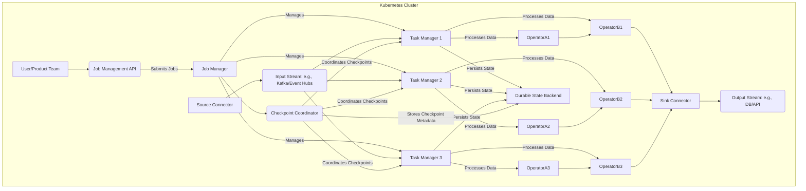

# Flink.NET

**Flink.NET** is an ambitious open-source project aiming to create a powerful, scalable, and fault-tolerant stream processing engine, built entirely within the .NET ecosystem. Inspired by the robust architecture and comprehensive feature set of [Apache Flink](https://flink.apache.org/), Flink.NET seeks to provide .NET developers with a native solution for building sophisticated real-time data processing applications.

The core objective of Flink.NET is to implement the fundamental concepts that make Apache Flink a leader in stream processing, including:

*   **Stateful Stream Processing:** Enabling complex computations over unbounded data streams with rich state management capabilities.
*   **Exactly-Once Semantics:** Ensuring data integrity and consistency even in the face of failures.
*   **High Throughput and Low Latency:** Designing for performance to handle demanding real-time workloads.
*   **Rich Connectors and APIs:** Providing a flexible framework for integrating with various data sources and sinks, and offering intuitive APIs for developers.

This project endeavors to bring the power of distributed stream processing to the .NET world, allowing developers to leverage their existing C# skills and .NET libraries to build cutting-edge data-intensive applications. While drawing heavily from Apache Flink's proven design patterns, Flink.NET will also embrace .NET idioms and best practices to create a familiar and productive environment for its users.

## Table of Contents
- [Business Requirements](#business-requirements)
- [Why Flink.NET?](#why-flinknet)
- [System Design Overview](#system-design-overview)
  - [Key Architectural Components](#key-architectural-components)
  - [Architectural Diagram](#architectural-diagram)
- [Core Processing Features](#core-processing-features)
  - [Operator Chaining](#operator-chaining)
  - [Credit-Based Flow Control](#credit-based-flow-control)
- [Project Status](#project-status-placeholder)
- [Samples and Tutorials](#samples-and-tutorials)
- [AI-Assisted Development](#ai-assisted-development)
- [Getting Involved & Contribution](#getting-involved--contribution)
- [Documentation](#documentation)
- [License](#license)
- [Full Documentation (Wiki)](./docs/wiki/Wiki-Structure-Outline.md)

## Business Requirements

Flink.NET is being developed to meet a stringent set of business requirements crucial for modern data processing applications:

1.  **Data Integrity (Exactly-Once Semantics):** Guarantees that all data is processed precisely once, without duplicates or omissions, even during failures.
2.  **Message Uniqueness (Deduplication):** Ensures each message is uniquely identifiable, with custom deduplication logic using a durable state store to prevent reprocessing.
3.  **Processing Idempotency:** Designs all processing logic and sinks to be idempotent, so reprocessing a message yields the same result without side effects.
4.  **Error Handling and Recovery (Checkpointing/Snapshotting):** Includes robust checkpointing and state persistence for automatic recovery from failures, restoring state and resuming from the correct point. This aligns with concepts like Apache Flink 2.0's Disaggregated State Management, which aims to make checkpointing and recovery even more efficient and scalable in cloud-native environments.
5.  **Communication Idempotency (External Systems):** Aims to provide an "exactly-once" experience for product teams even when interacting with external systems that don't offer idempotency guarantees, minimizing double processing.
6.  **Transaction Management (Atomic Writes):** Implements mechanisms like two-phase commit to coordinate transactions across internal state and external sinks, ensuring atomicity. This is supported by patterns similar to Apache Flink's TwoPhaseCommitSinkFunction, and Flink 2.0's ongoing enhancements in connector APIs and state consistency further strengthen such transactional capabilities.
7.  **Durable State Management:** Utilizes a durable, fault-tolerant backend for all processing state, ensuring consistency and recoverability. The evolution of Apache Flink, such as Flink 2.0's Disaggregated State Management (including concepts like the ForSt backend and asynchronous state access), provides a strong reference for implementing highly available and scalable durable state in Flink.NET.
8.  **End-to-End Acknowledgement:** For multi-step processing, uses tracking IDs to provide a single ACK (success) or NACK (failure) for the entire flow.
9.  **Partial Failure Handling (NACK for Split Messages):** For messages processed in parts, NACKs indicate partial failure, allowing selective retries or full replay.
10. **Batch Failure Correlation & Replay:** For batched messages, failures update related message statuses, with visual inspection and replay capabilities for failed batches.
11. **Flexible Failure Handling (DLQ & Message Modification):** Offers choices for handling processing failures (stop or DLQ), and allows modification and resubmission of messages from a DLQ, managed via a consistent state system.

These requirements drive the architecture towards a fault-tolerant, stateful stream processing system with strong data consistency guarantees.

### Further Considerations on Flink.NET and Apache Flink

Apache Flink, particularly with advancements in Flink 2.0, directly addresses all 11 business requirements through its core architecture. Key features include its powerful checkpointing (enhanced by concepts like Disaggregated State Management in Flink 2.0) for fault-tolerant state management and recovery (requirements 1, 4, 7), managed keyed state for efficient deduplication and uniqueness (requirement 2), and the TwoPhaseCommitSinkFunction for end-to-end transactional integrity with external systems (requirements 3, 5, 6).

While Apache Flink's lack of native .NET support necessitates the reimplementation of these evolving concepts within the .NET ecosystem for Flink.NET, the effort is substantial. However, it offers the benefit of full control over the .NET implementation and the potential for a valuable open-source contribution to the .NET community. Requirements 8, 9, 10, and 11, for instance, would be realized as custom operators and sinks within Flink.NET, leveraging this Flink-inspired foundational system. The ongoing evolution of Flink (e.g., Flink 2.0) serves as a continuous source of inspiration for these efforts.

With current AI capabilities and Flink's open-source nature, AI could assist in rapidly drafting and refining Flink.NET's .NET implementation. This endeavor also helps build our company's reputation by contributing to the .NET landscape for big data processing. Alternatively, one might consider adopting Apache Flink directly and transitioning to the Java ecosystem.

## Why Flink.NET?

While Apache Flink stands as a powerful and mature stream processing solution, Flink.NET aims to address several key motivations and create unique value, particularly for organizations and developers invested in the .NET ecosystem:

*   **Native .NET Capabilities:** Provides a stream processing framework that integrates seamlessly with existing .NET applications, libraries, and skillsets. This allows .NET teams to build sophisticated stream processing solutions without needing to bridge to or manage a separate Java-based infrastructure.
*   **Leveraging the .NET Ecosystem:** Enables the use of familiar .NET tools, languages (C# primarily), and development patterns, fostering productivity and reducing the learning curve for .NET developers.
*   **Optimized Cloud-Native Performance:** Leveraging .NET's performance characteristics and optimized containerization on Kubernetes, Flink.NET aims to explore advantages such as potentially faster application startup times and a more streamlined resource footprint compared to traditional JVM-based solutions in similar cloud-native deployments.
*   **Open Source Contribution & Community Building:** By being an open-source project, Flink.NET aims to contribute to the .NET community, fostering collaboration and innovation in the big data and stream processing space within the .NET world. It offers an opportunity to build and shape a significant piece of .NET infrastructure.
*   **Addressing Specific Organizational Needs:** For teams primarily working with .NET, having a native Flink-like engine can simplify deployment, monitoring, and operational overhead compared to managing a polyglot environment.
*   **Modern Development Approaches:** The project was initiated with the idea of potentially leveraging modern development techniques, including AI-assisted code generation and insights, to accelerate its development and explore new ways of building complex software.
*   **Enhancing Technical Reputation:** Contributing a high-quality, Flink-inspired stream processing engine to the open-source .NET landscape can significantly enhance the technical reputation and leadership of contributing organizations and individuals.
*   **Full Control and Customization:** Building Flink.NET from the ground up in .NET offers complete control over the architecture and implementation, allowing for fine-tuned customizations and optimizations tailored to specific .NET environments or performance characteristics.

Flink.NET is not just about replicating Apache Flink in a new language; it's about creating a first-class, .NET-native stream processing engine that empowers .NET developers and enriches the .NET open-source ecosystem.

## System Design Overview

Flink.NET is architected as a distributed stream processing system designed for scalability, fault tolerance, and exactly-once processing semantics. It draws inspiration from Apache Flink's robust architecture, adapting its core components to the .NET ecosystem and a Kubernetes-native deployment model.

### Key Architectural Components

The system comprises several key interacting components:

*   **[JobManager](./docs/wiki/Core-Concepts-JobManager.md) (Singleton/Leader Election):** This central component orchestrates job execution, manages checkpoints for fault tolerance, detects failures, and coordinates recovery processes. In a high-availability setup, leader election ensures there's always one active JobManager.
*   **[TaskManagers](./docs/wiki/Core-Concepts-TaskManager.md) (Worker Nodes):** These are distributed .NET applications, typically running as Kubernetes Pods. TaskManagers are responsible for:
    *   Consuming input data streams.
    *   Executing the actual data processing logic (operators defined by the user).
    *   Managing local state for stateful operations (see [State Management Overview](./docs/wiki/Core-Concepts-State-Management-Overview.md)).
    *   Interacting with external data sinks.
*   **Connectors (Sources & Sinks):** These are specialized components or libraries responsible for interfacing with external data systems. Sources read data from systems like Apache Kafka, Azure Event Hubs, etc., while Sinks write processed data to databases, APIs, or other messaging systems.
*   **Durable State Backend:** A persistent, scalable, and highly available storage solution is used to store all processing state and checkpoint metadata. This is crucial for achieving fault tolerance and exactly-once semantics, as detailed in the [Checkpointing Overview](./docs/wiki/Core-Concepts-Checkpointing-Overview.md). For cloud-native deployments, inspiration is drawn from concepts like Apache Flink 2.0's Disaggregated State Management, which decouples state storage (often using Distributed File Systems like S3 or HDFS, managed by backends like Flink's ForSt) from compute resources and utilizes asynchronous state access. This approach aims to enhance scalability, resource efficiency, and recovery speed, guiding Flink.NET's strategy for robust state handling.
*   **[Memory Management](./docs/wiki/Core-Concepts-Memory-Overview.md):** Understanding how Flink.NET manages memory for JobManagers, TaskManagers, network buffers, and state is crucial for performance and stability. This includes configurations for Kubernetes and local deployments, tuning, and troubleshooting.
*   **Job Submission & Management API:** A RESTful (and potentially gRPC) API exposed by the JobManager allows users and external systems to submit new processing jobs, monitor their status, manage their lifecycle (e.g., stop, cancel, scale), and inspect checkpoint information.

### Architectural Diagram

The following diagram illustrates the high-level interaction between these components within a Kubernetes environment:

This architecture is designed to enable parallel processing of data streams across multiple TaskManagers, coordinated by the JobManager, with robust state management and fault tolerance mechanisms ensuring data integrity and continuous operation.

## Core Processing Features

### Operator Chaining

FlinkDotNet implements operator chaining to optimize job performance by fusing chainable operators into a single task. This reduces thread-to-thread handovers, serialization/deserialization overhead, and network communication for co-located operators. Chaining behavior can be controlled globally and at the individual operator level.

For more details, see [[Operator Chaining|docs/wiki/Operator-Chaining.md]].

### Credit-Based Flow Control

To ensure stable data processing and prevent fast producers from overwhelming slower consumers, FlinkDotNet employs an explicit, Flink-inspired credit-based flow control mechanism for its network communication. This system regulates data transfer based on the availability of buffers on the receiver side, propagating backpressure efficiently.

For more details, see [[Credit-Based Flow Control|docs/wiki/Credit-Based-Flow-Control.md]].

## Project Status

Flink.NET is currently in an **alpha/foundational development stage**. Key architectural components like the JobManager, TaskManager, and basic stream processing APIs are in place. A .NET Aspire-based simulation environment has been set up to facilitate testing and development (see [Samples and Tutorials](#samples-and-tutorials)).

**Current Focus & Next Steps:**
The immediate focus is on implementing **Phase 1: Core Functionality for Exactly-Once FIFO Processing**. This includes:
*   **Barrier-Based Checkpointing:** Design and initial implementation stages for fault tolerance and exactly-once semantics. A preliminary design for checkpoint barriers has been documented ([Core Concepts: Checkpointing - Barriers](./docs/wiki/Core-Concepts-Checkpointing-Barriers.md)).
*   **High-Performance Default Serializers & Robust Custom Serializer Support:** Addressing current bottlenecks with POCO serialization is a priority.
*   **Full Keyed Processing Logic:** Implementing robust support for keyed streams, including state management per key.

**Implemented So Far (Highlights):**
*   Core JobManager and TaskManager services with gRPC communication.
*   Basic stream processing API (`StreamExecutionEnvironment`, `DataStream`, simple operators like Map, Sink, Source).
*   JobGraph model and submission from client to JobManager.
*   .NET Aspire project for local cluster simulation, including Redis and Kafka integration for samples.
*   Initial observability setup using OpenTelemetry, viewable in the Aspire Dashboard.
*   Proof-of-concept for client-side send throttling.

**Future Phases (Long-Term Vision):**
*   **Phase 2: Performance Optimization for High Throughput** (e.g., operator chaining, advanced flow control).
*   **Phase 3: Robustness and Advanced Features** (e.g., production-ready state backends, incremental checkpointing, memory optimizations).

The project welcomes contributions, especially for the core features outlined in these phases.

## Samples and Tutorials

Explore practical examples and tutorials to understand how to use Flink.NET and see its capabilities in action.

*   **[Local High Throughput Test with Redis](./docs/wiki/Sample-Local-High-Throughput-Test.md)**:
        Learn how to set up a local Flink.NET environment using .NET Aspire. This sample runs a high-throughput test (e.g., 10 million messages) where messages are generated with sequence IDs from Redis, processed, and then sent to both a Kafka topic and a separate Redis counter. It demonstrates basic job submission, execution with multiple sinks, and observability within the Aspire framework.

## AI-Assisted Development
The development of Flink.NET, including aspects of its documentation, design, and implementation strategies, has been significantly accelerated and enhanced with the assistance of Google's Jules AI. This collaboration showcases a modern approach to tackling complex software engineering challenges and rapidly iterating on the project.

## Getting Involved & Contribution

We welcome contributions from everyone to help make Flink.NET a robust and feature-rich stream processing engine for the .NET ecosystem!

If you are a senior-level (or above) engineer from a top technology company and are interested in becoming an admin with merge rights, please reach out to the project maintainers and provide a link to your LinkedIn profile for consideration.

## Documentation

For comprehensive documentation, please visit the [Flink.NET Wiki](./docs/wiki/Wiki-Structure-Outline.md).

Key starting points in the wiki include:
*   [Getting Started Guide](./docs/wiki/Getting-Started.md)
*   [Core Concepts Overview](./docs/wiki/Wiki-Structure-Outline.md)
*   [Developing Applications](./docs/wiki/Developing-Operators.md)

## License

This project is licensed under the Apache License 2.0. See the [LICENSE](LICENSE) file for details (once created) or visit [Apache License 2.0](https://www.apache.org/licenses/LICENSE-2.0).
