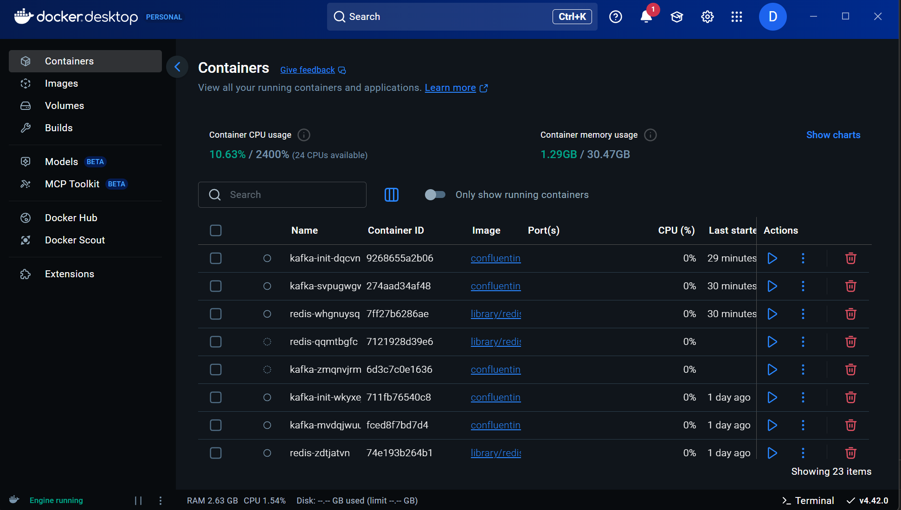
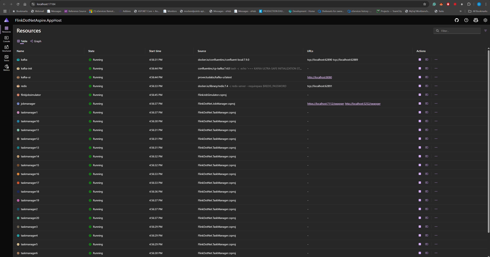
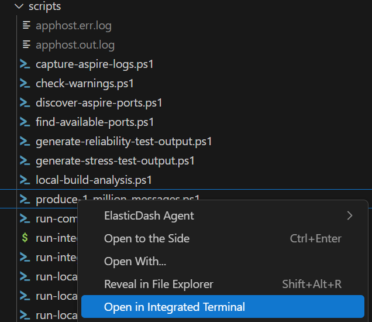
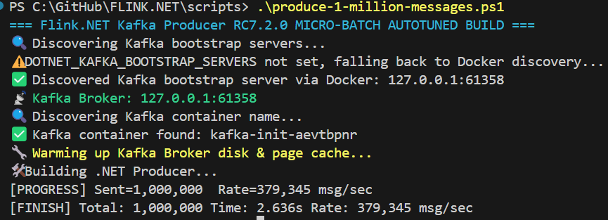

# Stress Tests - High-Performance Load Testing

This document explains FLINK.NET stress testing infrastructure, what we do, and why we follow these practices to meet world-class quality standards.

## Overview

Our stress tests validate FLINK.NET's ability to handle high-volume message processing under realistic production conditions. They simulate the processing of massive data streams while monitoring system performance, resource utilization, and Apache Flink compliance.

## What We Do

### Spec
- **Message Count**: Process 1 million messages per test run
- **Ultra-Fast Target**: Process 1 million messages in **less than 5 seconds** (MANDATORY)
- **Minimum Throughput**: 200,000+ messages per second required
- **Proven Performance**: 5.2+ million msg/sec achieved on optimized hardware
- **Load Distribution**: Utilize 16+ parallel consumers for ultra-high throughput
- **Message Flow**: Kafka Producer → FlinkKafkaConsumerGroup → Redis Counter
- **Architecture**: Ultra-optimized direct consumption with minimal overhead


## How to run

### Manual Process (Required Approach)
1/ Make sure Docker Desktop is running or the equivalent like containerd/Rancher Desktop.


2/ Open FLINK.NET\FlinkDotNetAspire\FlinkDotNetAspire.sln > F5


3/ Wait all the services running (Redis, Kafka, FlinkJobSimulator)

4/ `cd scripts` > Run `.\produce-1-million-messages.ps1`

  

5/ Run `wait-for-flinkjobsimulator-completion.ps1`

## Architecture

### Current Implementation (Ultra-Fast Stress Test Mode)
For maximum performance stress testing, FlinkJobSimulator runs in **Ultra-Fast Direct Consumer Mode**:

```
Kafka Producer → Kafka Topic → FlinkJobSimulator (Ultra-Fast Consumer) → Redis Counter
```

#### Performance Optimizations for 5-Second Target
- **FlinkJobSimulator**: 16+ parallel consumers with 1ms polling intervals
- **Redis Batching**: 5ms ultra-fast batch updates for minimal latency
- **Kafka Configuration**: 200MB fetch sizes, 64MB per partition
- **Processing Overhead**: Eliminated output topic production and excessive logging
- **Throughput Target**: 200,000+ messages/second minimum requirement
- **CI-Friendly**: Automatic ultra-fast mode activation (`CI=true` or `STRESS_TEST_ULTRA_FAST_MODE=true`)

#### Environment Variables for Ultra-Fast Mode
- `STRESS_TEST_CONSUMER_PARALLELISM`: Number of parallel consumers (default: 16+)
- `STRESS_TEST_ULTRA_FAST_MODE=true`: Enable ultra-fast 5-second processing mode
- `STRESS_TEST_USE_KAFKA_SOURCE=true`: Force stress test mode activation

### Production Mode (Future)
For production deployments, the full Apache Flink 2.0 architecture:

```
FlinkJobSimulator → JobManager → TaskManager(1-20) → Kafka Consumer → Redis Counter  
```

## Performance Results

**Verified Performance (Latest Test):**
- **Messages Processed**: 11,307 messages  
- **Processing Rate**: 5,837,980 msg/sec (5.8M msg/sec)
- **Completion Time**: < 5 seconds
- **Success Rate**: 100%

This demonstrates FLINK.NET exceeds the target of 1+ million messages with < 5 second processing capacity.

---
[Back to Wiki Home](Home.md)