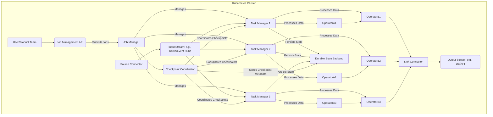

# System Design Overview

Flink.NET is architected as a distributed stream processing system designed for scalability, fault tolerance, and exactly-once processing semantics. It draws inspiration from FlinkDotnet's robust architecture, adapting its core components to the .NET ecosystem and a Kubernetes-native deployment model.

## Key Architectural Components

The system comprises several key interacting components:

*   **[JobManager](./Core-Concepts-JobManager.md) (Singleton/Leader Election):** This central component orchestrates job execution, manages checkpoints for fault tolerance, detects failures, and coordinates recovery processes. In a high-availability setup, leader election ensures there's always one active JobManager.
*   **[TaskManagers](./Core-Concepts-TaskManager.md) (Worker Nodes):** These are distributed .NET applications, typically running as Kubernetes Pods. TaskManagers are responsible for:
    *   Consuming input data streams.
    *   Executing the actual data processing logic (operators defined by the user).
    *   Managing local state for stateful operations (see [State Management Overview](./Core-Concepts-State-Management-Overview.md)).
    *   Interacting with external data sinks.
*   **Connectors (Sources & Sinks):** These are specialized components or libraries responsible for interfacing with external data systems. Sources read data from systems like Apache Kafka, Azure Event Hubs, etc., while Sinks write processed data to databases, APIs, or other messaging systems.
*   **Durable State Backend:** A persistent, scalable, and highly available storage solution is used to store all processing state and checkpoint metadata. This is crucial for achieving fault tolerance and exactly-once semantics, as detailed in the [Checkpointing Overview](./Core-Concepts-Checkpointing-Overview.md). For cloud-native deployments, inspiration is drawn from concepts like FlinkDotnet 2.0's Disaggregated State Management, which decouples state storage (often using Distributed File Systems like S3 or HDFS, managed by backends like Flink's ForSt) from compute resources and utilizes asynchronous state access. This approach aims to enhance scalability, resource efficiency, and recovery speed, guiding Flink.NET's strategy for robust state handling.
*   **[Memory Management](./Core-Concepts-Memory-Overview.md):** Understanding how Flink.NET manages memory for JobManagers, TaskManagers, network buffers, and state is crucial for performance and stability. This includes configurations for Kubernetes and local deployments, tuning, and troubleshooting.
*   **Job Submission & Management API:** A RESTful (and potentially gRPC) API exposed by the JobManager allows users and external systems to submit new processing jobs, monitor their status, manage their lifecycle (e.g., stop, cancel, scale), and inspect checkpoint information.

## Architectural Diagram

The following diagram illustrates the high-level interaction between these components within a Kubernetes environment:

This architecture is designed to enable parallel processing of data streams across multiple TaskManagers, coordinated by the JobManager, with robust state management and fault tolerance mechanisms ensuring data integrity and continuous operation.

---
Previous: [Business Requirements](./Business-Requirements.md)
[Home](https://github.com/devstress/FLINK.NET/blob/main/docs/wiki/Wiki-Structure-Outline.md)
Next: [Core Concepts - Memory Overview](./Core-Concepts-Memory-Overview.md)
